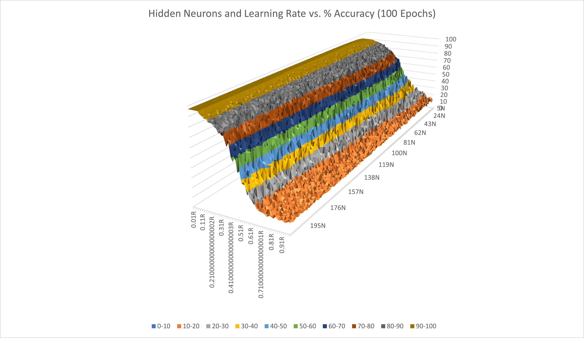

# Neural Networks Project - Seth Knights

An from-scratch implementation of a single hidden-layer neural network in Java.
## Writeup:

As written, my code has been successfully tested on four main data sets:
- AND functions
- XOR functions
- [AK Handwritten Digits](https://archive.ics.uci.edu/ml/datasets/Optical+Recognition+of+Handwritten+Digits)
- [MNIST Handwritten Digits](https://catlin.instructure.com/courses/1760/pages/mnist-handwritten-digits)

On top of normal learning, there are functions to help manage multi-threaded multi-variable testing to help in
determining ideal numbers of hidden nodes and learning rates. This outputs the data to a file, which can then be parsed
again and re-written into a form readable by Excel as a 3D graph. (This in-between step exists to help save data from
being lost if the multi-threaded process fails, or if you want to end it early.)

An example of the output from this multithreaded application can be seen below. This is the AK Handwritten Digits set,
varying over 5-205 hidden neurons and a learning rate between 0.01 and 1. All learning was cut off after a 100 epochs,
and each test was ran 10 times and then averaged.

Overall, my neural network was successful to these standards:

| Dataset       | # Hidden  | Learning Rate | Testing Accuracy  | Epochs |
| -------       | --------  | ------------- | --------  | ------ |
| AND           | 2         | 1.0           | 100%      | ~80    |
| XOR           | 2         | 0.05          | 100%*     | ~28000 |
| AK Digits     | 138       | 0.02          | 97-98%    | ~100   |
| MNIST Digits  | 138       | 0.05          | 94-95%    | <200** |

I would have added Training Accuracy but did not have time to re-record these values (and it was 100% for both AND 
and XOR which are shorter, and around 99% for AK Digits).

-* There is some instability here that has not been ironed out (as was discussed in class).

-** I lost the data from when I ran these tests, and I think I may have had a lower learning rate. I know from my code
that it was within 200 epochs however.

Overall, most of the stuff here needs some more testing to iron out actual *best* results, but these are what I was able
to get in the midst of working on the project.
